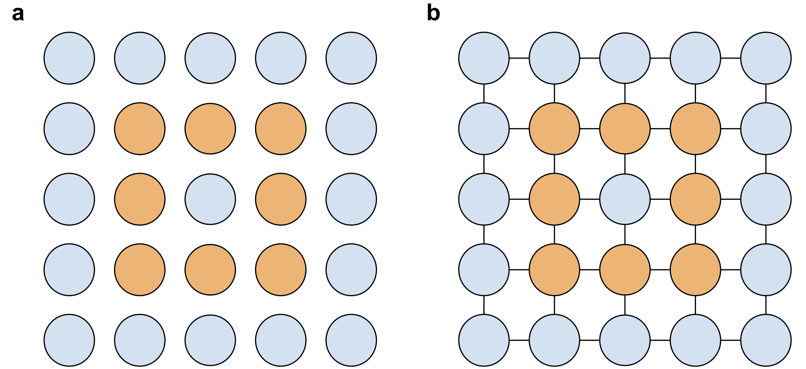
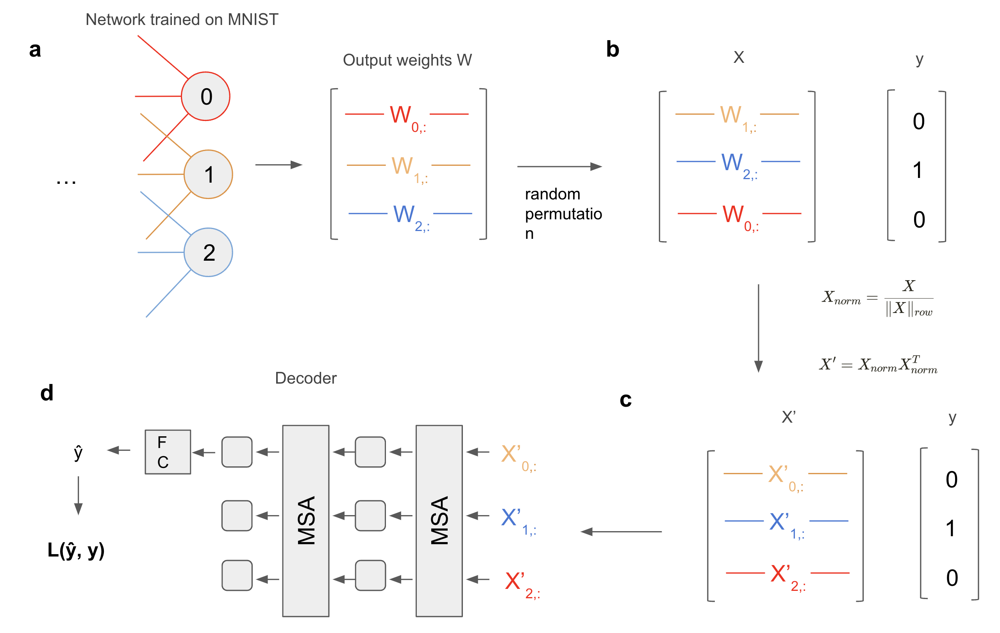
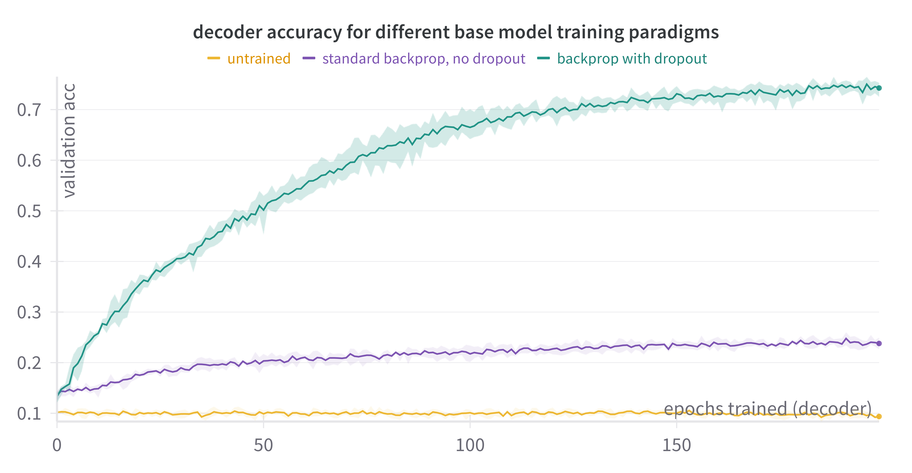
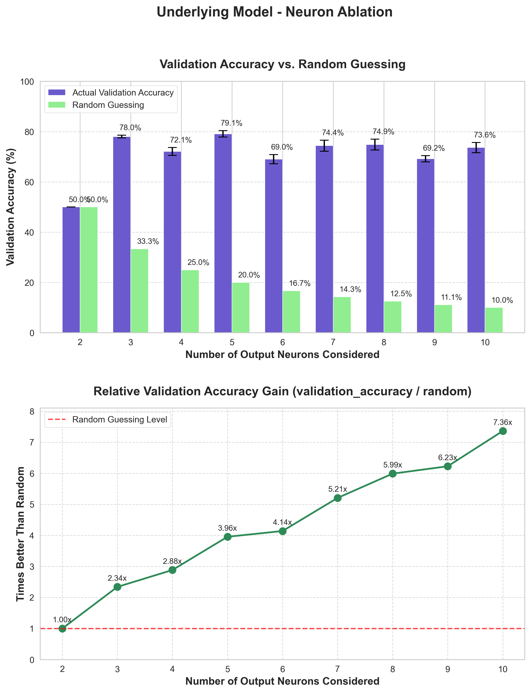
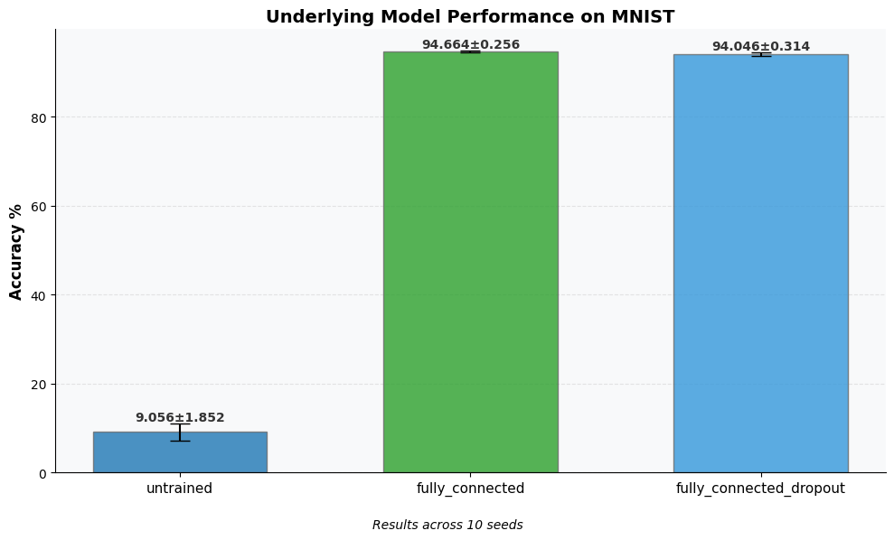
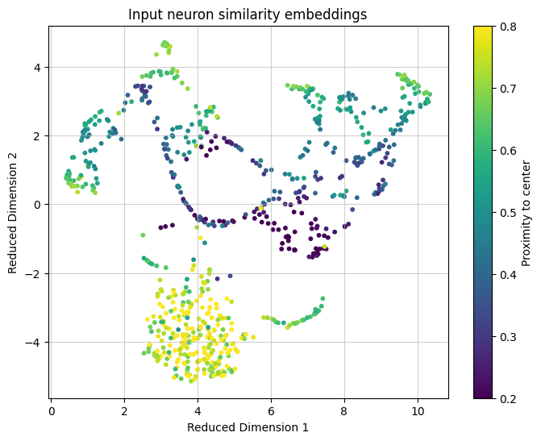
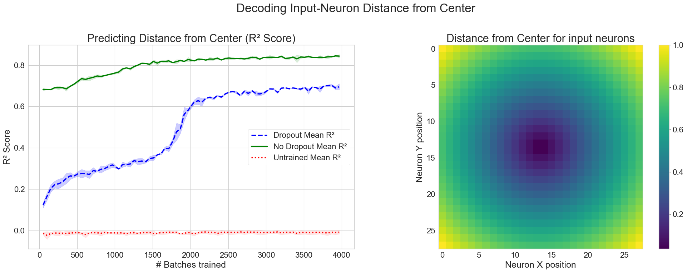

### Links
- [Original pdf](https://www.flaessig.com/uploads/consciousness-and-unambigous-representations.pdf)
- [Code](https://github.com/entropicbloom/intentionality)

# Contents
{: .no_toc}

* TOC
{:toc}

# Theory

## Ambiguous representations
Representations are ubiquitous within our daily lives: Letters represent sounds, words represent concepts, bit strings represent files, etc. However, these representations are only meaningful insofar as they are decoded in the right way. Roman letters are meaningless to someone only familiar with Chinese characters, the word ’Utang ́atta’ is only meaningful if you know Icelandic, and a bit string representing a JPEG image of an apple only does so if the right decoding algorithm is applied. In fact, given the right decoding algorithm, the same bit string could be decoded into a sound file, a video game, a text, or any other type of digital medium. Generally speaking, there is no information inherent in a bit string that tells us anything about what it is about. For all examples provided so far, this does not pose a problem. Representations such as letters, words and bit strings are useful because we can agree on decoding schemes that should be applied for a given set of representations. Representations in conjunction with an encoding scheme bear meaning, thus rendering them useful to us. Without an encoding scheme, however, most representations are ambiguous: they could represent anything.

## Representational accounts of consciousness
One strategy to think about a mapping between neural activity and conscious experience is in terms of a representational relationship [^1]. If I see an apple, neural activity in my brain is representing an apple. This idea of a representational relationship accounts for the fact that the experience of an apple is not dependent on the presence of the actual apple in the real world. After all, dreams and hallucinations of apples are real phenomena. If conscious experience corresponds to the presence of representations, dreams of apples can be explained as instantiating a representation in the absence of the actual apple in the real world. But this begs the question of what encoding scheme is used to represent the visual perception of an apple in terms of neural activity.

## Conscious content is determined
It is reasonable to assume that a brain in a given state has a determined conscious experience, (or a determined set of conscious experiences to allow for the case of islands of consciousness that could conceivably occur in healthy individuals or perhaps more likely in split brain patients [^2]) In any case, a given brain state that is postulated to account for a given experience cannot at the same time account for a different, conflicting experience. In other words, if I see an apple, then part of my brain is representing an apple, and the same neural activity is not also representing an orange, or the sound of a passing car (which could concurrently be represented, but not alternatively decoded instead of decoding the apple). This is arguably already the case prior to any higher cognitive judgements about the nature of the experience, as the appearance of the apple itself already presupposes what it is about. Not only does it presuppose it’s about an apple, but it presupposes it’s about something visual [^3]. Acting upon the correct identification of the object is not necessary for postulating that a representation has determined content. This is because, while the content of consciousness certainly guides our behavior, it is arguably not dependent on it [^4].

## Conscious content is not determined by a decoder
Given what we know about the nature of bit string encodings of images and similar representations, it might be tempting to propose a decoder within our brain that gives meaning to our representations of the real world. If we follow this line of reasoning, it would be our ‘internal decoder’ that is responsible for conscious experience, since, only when decoded do representations become meaningful. But all a decoder can do is to transform representations in one encoding to a different encoding. We are still left with the question of how this new encoding ‘knows’ what it is about, or, in other words, why this representation is about one specific thing (an apple) as opposed to anything else. Postulating a special brain area that reads out the meaning of representations is just an instance of the internal homunculus or cartesian theater fallacy [^5].

## Conscious representations are unambiguous
If the content of conscious representations is determined, and if we can’t rely on a decoder to give it meaning, we must assume that, unlike for bit strings or letters, the encoding intrinsically carries meaning about the intentional content of the representation. This gives us a formal requirement for a conscious representation.

**Definition 1**
: The intentionality constraint on NCCs requires that an explanatory NCC of an aspect of conscious experience must unambiguously represent that aspect.

**Corollary 1**
: Conscious representations need to carry meaning about how they are representing things in addition to what they are representing.

To illustrate the strength of this constraint, let’s consider again the JPEG. While the meaning of a bit string representing a JPEG image is ambiguous and meaningless by itself, given enough pairs of bit strings and images, one could deduce the decoding, and thus the meaning of the individual bit string. However, the contents of consciousness of a subject are already determined within one moment (again, subject to microgenesis constraints). There is no need for some external observer to scan the subject’s brain in many different states to give meaning to the current conscious representations. To the brain itself, they carry meaning, i.e. represent a determined conscious experience, in every moment.
Note that I’m proposing that this intentionality constraint is a necessary, but not necessarily sufficient condition for phenomenal consciousness. While an unambiguous representation might have clear intentional content to an outside observer, this content might not ‘appear to itself’. We might have to postulate additional requirements, such as ‘integration’ for consciousness to arise.

## Defining ambiguity

An unambiguous representation conveys content as well as how to decode that content, thus leaving us with only one possible interpretation. On the other hand, a representation is ambiguous to the extent that it does not exclude other possible interpretations. To allow for a spectrum of ambiguity levels, with completely ambiguous representations such as random bit strings on the one hand, and completely unambiguous conscious representations on the other, we propose the following formalism:

$$\text{Ambiguity} = H(I|R)$$

where $$H$$ denotes the entropy function and $$(I\vert R)$$ the probability distribution of all possible interpretations given a certain representation. Of course, despite the mathematical formulation, without further assumptions this is not a computable quantity. In addition to the set of interpretations being intractable, the relationship between representations and possible interpretations is not clear, although relation-preservation might be a good candidate [^6]. Still, this definition of representational ambiguity should help the reader get a sense for what I mean with 'ambiguity'.

To illustrate this formulation with a concrete example, consider a simple case where a representation $$R$$ can have three possible interpretations $$I = \{i_1, i_2, i_3\}$$. For a completely ambiguous representation (like a random bit string), the conditional probability distribution would be uniform: $$p(i_1 \vert R) = p(i_2 \vert R) = p(i_3 \vert R) = 1/3$$, yielding $$H(I \vert R) = \log_2(3) \approx 1.58$$ bits. For a partially unambiguous representation that strongly suggests one interpretation over others, we might have $$p(i_1 \vert R) = 0.7$$, $$p(i_2 \vert R) = 0.2$$, $$p(i_3 \vert R) = 0.1$$, yielding $$H(I \vert R) = 0.9$$ bits. Finally, for a completely unambiguous representation like those postulated for consciousness, we would have $$p(i_1 \vert R) = 1$$, $$p(i_2 \vert R) = p(i_3 \vert R) = 0$$, yielding $$H(I \vert R) = 0$$ bits. This illustrates how the ambiguity measure captures the uncertainty about the correct interpretation given a representation.

If you think you lack the intuition of how the shape of a probability distribution affects entropy, check out [this interactive web app](https://claude.site/artifacts/fc5e20cc-2a3f-472a-ab20-13ff022e10fc){:target="_blank"}.

## Relational structures as unambiguous representations

How could any type of encoding convey meaning without presupposing a decoding scheme? We saw that a bit string cannot do the job. The reason for that is that it is a purely indexical object. A bit string is a number, and all it tells us is that it is this number and not any other number. What we need is structure. Let’s illustrate this using an example. Let’s say we encode 5x5 image of a square by encoding all the values of the individual pixels, giving us a 25-dim vector as seen in Figure 1a.

_Figure 1: **a:** Visualization of the elements of a binary vector (orange=1, blue=0) as a square grid. **b:** Set of relations between neighboring vector elements in addition to the vector elements themselves._

While Figure 1a looks to us like it is representing a square, this is only true because we have arranged the values of the vector in the appropriate way. The information about how the vector should be decoded is not contained within the vector itself. However, if in addition to the vector, we include a set of relations to our representations that link neighboring vector elements (Figure 7b), then the read-out of the vector as a square grid ceases to be arbitrary.
Essentially, we give every vector element a meaning by defining how it relates to other vector elements. The values of the vector lose their arbitrariness to some extent. Note that I am not claiming that this structure can account for the richness of spatial experience (see [^7] for a more rigorous treatment of spatial experience in the context of IIT), but it can restrict the space of possible decodings to some extent, giving rise to the possibility of unambiguously decoding something like a square.
Relational structures as physical or functional correlates of consciousness have already been discussed in much more detail by Kleiner and Ludwig [^6]. They are motivated by the idea that a mathematical structure of consciousness should be about consciousness. In this sense, what I am proposing might be a restatement of their thesis. Nevertheless, I believe that approaching the same idea from the perspective of representations and ambiguity leads to a useful and complementary motivation for relational approaches to NCCs.

Consider a musical major chord as an analogy for unambiguous relational structures. The identity of a 'major chord' emerges not from its individual notes but from their specific intervallic relationships (root, major third, perfect fifth). C-E-G, D-F#-A, and F-A-C are all recognized as major chords despite having different constituent notes because they maintain the same relational pattern. This structure gives each chord its characteristic 'major' quality that remains invariant across different keys. Similarly, neural networks may encode meaning through invariant relational patterns that persist despite variations in specific activations.

## Two types of structuralism
Within the field of consciousness research and philosophy of mind the idea of conscious experience being determined relationally is known as structuralism [^8]. However, it is important to note two types of structuralism:
1. The content of an experience is determined by its relation to all other possible experiences that a subject could have had.
2. The content of an experience is determined by relations instantiated in the current moment.
In both consciousness science and philosophy of mind literature, structuralism is often understood in the first sense [^8]. However, this does not address the intentionality constraint 1 because conscious experience is already determined in one moment. It is not clear how the mere potentiality of other experiences and their relations to the current one could actively determine the character of the current conscious experience. What I am suggesting is that conscious experience is determined in the second sense, i.e. by a relational structure that is instantiated in the current moment. It is quite possible that these two types of structuralism map onto each other somehow. Structuralism 2 might in some way be a mirror image or a consequence of nr 1. Nevertheless, to determine the character of the current experience, it is the 2nd one that counts.

## Structure of conscious experience needs to emerge unamiguously from substrate
Even if the proposed mathematical structure of experience encodes meaning intrinsically, the way this structure is obtained from the (neural) substrate cannot be arbitrary. If we need an arbitrary decoding algorithm to obtain our mathematical structure from the substrate, we again run into the problem of why this particular decoding scheme is used as opposed to any other. To avoid this, we need to unambiguously tie the relational structure to physical reality. In the following I want to list some potential requirements for this ’physical grounding’ of relational structures corresponding to conscious representations.
1. Temporal continuity of encoding. The way elements and relations of the mathematical structure representing conscious content are implemented in the physical substrate need to stay consistent over time. To consider a silly example, let’s say two elements of our relational structure are grounded in two carbon atoms, and that a relation relevant to the structure of the conscious experience of that system is grounded in a covalent bond of that structure. The fact that atoms ground elements and covalent bonds ground relations needs to stay consistent. If that were not the case, e.g. if atoms could suddenly encode relations instead of covalent bonds, there would be no way to determine contents of consciousness from a physical system.
2. Correspondence of concrete physical entities with elements of mathematical structure. Elements in a relational structure representing conscious contents need to correspond to physical ’objects’ that can be delineated from the rest of the universe by some objective measure. Otherwise, there remains inherent ambiguity about what the elements and relations of our structure are.
3. Physically meaningful connection between relations and elements of mathematical structure. Going back to our example of the carbon molecule, if two elements of a relational structure are grounded in two C atoms, then a relation between the two should be grounded in a physical quantity/object that relates the two carbon atoms. If the relation between the two elements grounded in the C atoms were grounded by a covalent bond in a different molecule, there would be inherent ambiguity about which relations link which elements of the relational structure.
Overall, ambiguity in a representation can arise at two stages:
1. The abstract mathematical representation is inherently ambiguous (for instance a bit string).
2. The way physical substrate implements this mathematical representation is ambiguous, i.e. although the abstract mathematical representation is intrinsically meaningful, it is not unambiguously decodable from the substrate. For instance, a mathematical structure (e.g a graph) could unambiguously represent a conscious experience, but the structure is encoded in binary switches using an arbitrary encoding.

## Neural Networks as mathematical structures of consciousness
Relational structures can give meaning to elements of a representation by defining how they are related to other elements. But what kind of relational structure might be dictating the contents of our consciousness? To answer this question, let’s return to the example of an image represented as a pixel vector. As mentioned previously, there is no way of knowing what a specific vector v is about, without being provided with the encoding scheme used. However, given the full distribution of natural images $$X ∼ p(x)$$, we could conceivably deduce that the vectors encode something 2D (this could be achieved by noticing strong correlations between vector elements corresponding to adjacent pixels and deducing the grid from that), and additionally, we could probably decode and visualize vector $$v$$, which is one sample of $$X$$. Does this make intentionality trivial? Not in the case of conscious representations. This is because a single conscious experience is already determined in the moment we are experiencing it. It doesn’t have to be compared against the whole distribution of other possible conscious experiences, at least not explicitly. After all, to see a square, we don’t have to see all possible arrangements of edges and shapes to make sense of that experience. However, implicitly we may make use of exactly this information. Through evolution and plasticity, our brain has learned to model real-world distributions in its neural circuitry. While this model only represents one, say, visual experience at any given moment, it embeds this representation within a network that models the structure of the whole distribution of all visual experiences encountered in the natural world. This way it re-instantiates the whole distribution when experiencing a single instance of it, thus giving it meaning. Essentially, by mirroring the distribution of the natural world (which involves modeling its relations), a neural network can not only unambiguously encode a mathematical structure corresponding to contents of consciousness, but the network itself might be a candidate for a mathematical structure of consciousness. This line of reasoning would arguably avoid ambiguity at both the abstract and the physical level: In terms of an abstract representation, a neural network can be unambiguously represent things because it encodes an intricate web of relations modeling real-world distributions. In terms of physical implementation, the abstract network structure is grounded in physics unambiguously because it corresponds to an actual network of real physical nodes and connections between these nodes.
One possible (naive) approach to think about this would be to look at neurons and their activity as elements, and connectivity as relations. However, there are still two ways to cash out network connectivity as a relational structure:
1. Relations could be encoded as structural connectivity, i.e. the presence of synapses and synapse strengths.
2. Relations could be encoded as functional connectivity, i.e. statistical relationships of activity between neurons.
The problem with the first option is that it comes with a certain disconnect between elements and relations of the structure, leaving open room for ambiguous representation. This is because network connections only represent the possibility of the activity of different neurons interacting, not the actuality. If, for example, in a given instant a synapse is not involved in shaping neural activity, but it constitutes a relation of the mathematical structure of consciousness, then what gives that particular synapse a privileged role in shaping the experience of the subject as opposed to some random synapse in a different subject, or any other physical quantity for that matter? If, on the other hand, we say that only synapses currently involved in shaping neural activity constitute relations in the mathematical structure of consciousness, then to what extent is it reasonable to say that it is the synapse itself, rather than the statistical effects on neural activity, that constitutes the grounding of a relation? Thus, I believe the second option seems more reasonable, since it directly links the elements and relations of the structure of experience by grounding them in the same physical quantity: neural activity. One way to cash out this idea would be to let the magnitude of neural activity ground the presence of elements, and correlations between activity of neurons to ground relations of the mathematical structure of consciousness (similar to what Pennartz proposes [^3]).

---

# Exhibit 1: MNIST Digit Representations

## Idea
In this experiment we illustrate how artificial neural networks can unambiguously represent inputs by capturing characteristics of the input distribution in their connectivity. For this, we propose the following task: For an unseen network trained to classify MNIST images, we want to deduce the class that a given output neuron encodes, with no guarantee about the order in which the output neurons are given. Moreover, we want to decode the class of a given neuron purely based on the connectivity of the output layer to the previous layer. The idea is that the connectivity of the network allows us to identify a relational structure between the output neurons that reflects characteristics of the MNIST distribution. Within this relational structure, we hypothesize that each MNIST class occupies a unique position relative to the other classes. This approach deviates somewhat from the aforementioned idea that ultimately functional networks rather than structural networks ground relational structures responsible for conscious representations. However, the experiment should still be relevant for two reasons: First, we are primarily interested in whether networks that emerge from learning a given input distribution can unambiguously encode information in the first place, regardless of the exact physical implementation of the network. Second, functional networks ultimately emerge from structural networks and the latter should be reflected in the former.

## Machine learning setup
To operationalize this idea, we want to turn it into a machine learning problem: Can we train a decoder that predicts the class of an output neuron purely based on connectivity of the output layer to the previous layer? (Please note that the use of a decoder in this experiment in no way negates our claim from [the previous section](#conscious-content-is-not-determined-by-a-decoder) that a decoder inside the brain cannot account for determined conscious content. Here we want to use a decoder to ascertain the presence of unambigous representations, but this does not imply that the decoder is necessary for the representations to be unambiguous.) Note that we cannot train the decoder on the same network it should be evaluated on, since that would result in the decoder learning a network-specific mapping of neurons to classes, and not a general principle of aboutness for MNIST. To avoid this, we train many networks using different random seeds on MNIST to generate the training and validation data. Crucially, data from the same network is only contained in either the training or the validation set, but not in both. This way, the only way for the decoder to solve the task is to learn to recognise consistent patterns in connectivity across different networks that are informative about class identity.

## Dataset
To train a decoder to predict which class a given output neuron represents based on the incoming weights to the output layer, we construct an input-output pair (X, y) in the following way: For a given network that was trained on MNIST, let W denote its output layer weights (Figure 2a). We define X as a matrix consisting of a random permutation of the rows of W (Figure 2b). This means that each row of X corresponds to the input weights of one of the output neurons of the underlying network. Moreover, any row of X could be associated with any of the output neurons of the underlying network, and thus with any of the 10 MNIST classes. Finally, we define y as the class index of whichever output neuron ended up being the first row of X. Thus, what the decoder ‘sees’ is a set of weight vectors corresponding to output neurons of the network. The position of these vectors within X contains no information, except that the decoder will have to predict the class index of the one that occupies the first row. To generate a dataset for one type of MNIST-classifying network, we train the underlying network on 1000 different random seeds, resulting in 1000 sets of output layer weights. Since each network has 10 output neurons, this gives us a total of 10,000 data points, one for each output neuron across all trained networks.

## Preprocessing
While the dataset we described above should contain all the information the decoder needs to predict the class of an output neuron by identifying its relations to other output neurons (if this relational structure does indeed exist), in practice we found that the decoder does not naturally learn to identify these relations well (at least not within the limited training time we used to fit the decoder). To point the decoder into the right direction, we applied the following preprocessing step to X.

$$
X_{norm} = \frac{X}{\|X\|_{row}}, \quad\quad  X' = X_{norm} X_{norm}^T
$$

$$
(X')_{i,j} = \frac{X_i \cdot X_j}{\|X_i\| \|X_j\|}
$$

Where $$X_i$$ denotes the i-th row of X, $$\|X\|_{row}$$ denotes row-wise L2 normalization (dividing each row by its L2 norm), and $$\cdot$$ represents the dot product. Like X, the rows of X′ all correspond to one of the output neurons and the first row corresponds to the output neuron whose class index should be predicted by the decoder (Figure 2c). However, instead of representing the incoming weights of an output neuron, a row now represents the cosine similarities between that neuron's incoming weights with all other output neurons' incoming weights. In other words, the value $$(X')_{i,j}$$ represents the cosine similarity between the incoming weights of output neuron i and output neuron j. Note that i and j correspond to the indices within X, which was created from a random permutation of WL. In other words, i and j are not informative of the class indices. However, X′ now encodes the output neurons in terms of their input weights in a much more explicitly relational fashion. In addition to facilitating better decoding accuracy, this has the advantage that the decoder, if successful, identifies classes of output neurons exclusively based on relational information.

## Decoder architecture
Because the order of the rows of X′ beyond the first row (which always corresponds to the output neuron whose class should be predicted) contains no useful information to solve the task, we want our decoder to be invariant to permutations of the rows of X′. We achieve this using a Transformer-like architecture with self-attention layers [^9], as seen in Figure 2d. We treat the rows of X′ as tokens, pass the data through two multi-head self-attention layers and finally read out the result from the first token’s learned representation using a linear layer that produces a 10-dimensional output. During training, we compute the cross entropy loss between this output and the label y. To compute the validation accuracy, we simply take the output of the decoder with the highest value as our class prediction for a given data point.

_Figure 2: Data processing pipeline from underlying MNIST-trained network to decoder. To simplify the diagrams, we are considering a hypothetical network with only 3 output units. **a:** As a basis for our decoding task we consider the output layer of a fully-connected feedforward network trained to classify MNIST using backpropagation. The connectivity matrix contains the incoming weights for each output neuron in its rows. **b:** To create a data point for the decoder, we permute the rows of the output layer connectivity matrix such that the class identity of an output neuron cannot be determined based on its position in the matrix. The input weights of the output neuron whose class identity should be predicted is in the first row. Hence, in this example, the second element of the target output y is equal to 1 because the original index of the output neuron in the first row of X is equal to 1. **c:** To facilitate extraction of relational information between output neurons, we generate matrix X′ by first normalizing each row of X and then computing $$X' = X_{norm}X_{norm}^T$$. Each element $$(X')_{i,j}$$ represents the cosine similarity between the incoming weights of output neuron i and output neuron j. Note that i and j correspond to the indices after permutation, which means they are not informative about class identity. **d:** The rows of X′ are treated as tokens and fed into a multi-head self-attention (MSA) based decoder network. We pass the data through two MSA layers, after which only the representation of the first token (corresponding to the first row of X′, which in turn corresponds to the output neuron whose class we want to identify) is fed into a fully-connected linear layer (FC) which maps to a 10-dimensional space (corresponding to the 10 MNIST classes). Finally, during training, the cross-entropy loss (L) is computed between the prediction $$\hat{y}$$ and the target value y._

## Results
To evaluate whether the output layers of the underlying MNIST networks encode relational information that allows us to identify the class of output neurons, we train our self-attention based decoder for 250 epochs on 8000 datapoints and validate its accuracy on the remaining 2000. We train the decoder on three different datasets, generated by training fully-connected networks on MNIST in three different training paradigms: no training, normal backpropagation, and backpropagation with dropout. The ’no training’ paradigm serves as a control. Since the underlying network connectivity is random, there should be no relevant relational structure in the output weights, and hence the decoder accuracy should be equivalent to random guessing (i.e. 0.1). The results are shown in Figure 3.
We can see that the accuracy of predicting output neuron classes based on their connectivity is above chance level (except for the control dataset of untrained networks, which yields chance-level accuracy as expected). Due to the way we designed our dataset, we can be fairly certain that the decoder achieves this purely based on relational information between output neurons. While training the decoder on the standard MNIST-trained networks (no dropout) yields some correct predictions resulting in a validation accuracy of roughly 25% at the end of training, the final accuracy jumps to about 75% as we switch to the dataset that was produced with dropout. Intuitively we are not surprised that dropout yields higher decoding accuracy, as encourages neurons to rely on population activity rather than single-neuron pathways [^10]. If output neurons rely on population activity of the last hidden layer, output neurons of similar MNIST digits should also have similar input weights, as they should share more features than output neurons representing dissimilar MNIST digits.

_Figure 3: Progression of the validation accuracy during 100 epochs of training the decoder to identify output neuron classes based on an unordered set of weight vectors of output neurons. The error margins reflect the standard deviation across 5 random seeds. We used three different training paradigms to generate the underlying MNIST-trained networks used to generate the data for the decoder: no training, normal backpropagation (FullyConnected), and backpropagation with dropout (FullyConnectedDropout). Note that the ’untrained’ flag in the legend refers to the underlying networks used to generate the training data, not the decoder._

To investigate how relational structure complexity affects decoding accuracy, we conducted an ablation study by systematically reducing the number of output neurons available to the decoder. Our results confirm that asymmetric relational structures between output neurons are essential for the decoder to function, as the 2-neuron case performs exactly at random chance level (50%, or 1.0x), since asymmetric relations cannot exist between only two points. While the 5-neuron condition achieves the highest absolute validation accuracy (79.1%), performance relative to random guessing increases consistently with neuron count, with the 10-neuron model performing 7.36x better than random (73.6%). This suggests that as the decoder gains access to more relational structure among output neurons, it becomes increasingly capable of decoding that structure, implying that decoder accuracy should continue to improve with more complex input distributions as the ambiguity of underlying representations decreases.

_Figure 4: Ablation study examining the impact of neuron count on neural network performance. The top panel compares validation accuracy (purple) to the random guessing baseline (green) for networks with 2-10 output neurons. Error bars represent standard deviation across 5 random seeds for each condition. The bottom panel shows the relative performance gain compared to random guessing. The 2-neuron case achieves only random-level performance (1.0x), validating the hypothesis that asymmetric relational structures in the output layer are necessary for the decoder to function. Performance relative to random chance increases with neuron count, with the 10-neuron model achieving 7.36x better than random performance._

To provide additional context for our results, Figure 5 shows the validation accuracies of the underlying MNIST models themselves (not the decoder). This comparison serves as an important sanity check and further highlights a key insight: despite the dropout-trained networks achieving virtually the same MNIST classification accuracy compared to the standard backpropagation networks, they yield dramatically higher decoder accuracies (75% vs 25% as shown in Figure 3). This disparity suggests that dropout fundamentally alters how information is represented within the network, creating more distinct relational structures between output neurons while leaving task performance unchanged. The fact that dropout networks are more decodable despite the same task performance suggests that the degree to which representations inside the network are ambiguous is to some extent orthogonal to task performance.

_Figure 5: Validation accuracies of the underlying MNIST models used to generate datasets for the decoder across 10 randomly sampled seeds for each training paradigm._

## Discussion
By achieving a decoding accuracy significantly higher than random guessing, we showed that networks trained on MNIST encode class identity of output neurons relationally in their output weights. We also showed that the extent to which this happens is dependent on the training paradigm used for the underlying networks. It is very likely that other training paradigms would yield even higher decoding accuracies, as we did not perform any optimization of hyperparameters. It is also possible that generative networks could yield higher accuracies than discriminative networks. Overall, these results support our claim that neural networks can unambigously (or at least less ambigously) represent their inputs by encoding relations between them. After all, the decoder can only decode representational content successfully if $$H(I \vert R)$$ is reduced. If $$H(I \vert R)$$ were maximal, all classes would be equally likely for each output neuron, and decoding accuracy would be close to random chance. However, it is important to note that what we really test for in our experiment is $$H(I \vert R,C)$$, where C denotes the 'context', in this case MNIST. The task of the decoder is not to guess what output neurons represent, given all possible things they could represent, but only given the knowledge that what we are decoding is an MNIST class. To what extent we can generalize from a reduction in $$H(I \vert R,C)$$ to a reduction in $$H(I \vert R)$$ needs to be investigated further.
Our experimental setup could easily be extended to decode other representational content of neural networks. For instance, staying with MNIST, given randomly permuted input neurons, one could try to decode their position in pixel space based on their connectivity to the next layer. Or, for natural image tasks, given randomly permuted color channels, one could try to decode the color from an input neuron based on their connectivity to the next layer. Moreover, the same decoding scheme might be applicable to neural data: X′ could be chosen as the correlation matrix of recorded neural activity.
In the ideal case, self-attention based decoders could generalize to decode representational content across different domains of inputs and across different network architectures, thus presenting a potential avenue for not just a 'consciousness meter', but a 'conscious content decoder'.

## Hyperparameters
In the following we list all hyperparameters that were chosen for the underlying networks to generate the dataset (Table 1), and for the self-attention based decoder (Table 2). Note that none of these hyperparameters were optimized using gridsearch or similar schemes, most of them were chosen quite arbitrarily, since this is only supposed to be a proof of concept.

 

| Name                                                   | Value |
|--------------------------------------------------------|-------|
| learning rate                                          | 0.001 |
| batch size                                             | 256   |
| epochs (except for the non-train paradigm)             | 2     |
| hidden dimensionalities                                | 50, 50|
| dropout rate (only for the dropout paradigm)           | 0.2   |

_Table 1: Hyperparameters for underlying, MNIST-trained networks used to generate the training and validation data for the decoder. Note that the number of epochs in the ’untrained’ paradigm was set to 0, and the dropout rate only applies to the ’dropout’ paradigm._

 
 

| Name                                                 | Value |
|------------------------------------------------------|-------|
| learning rate                                        | 0.001 |
| batch size                                           | 64    |
| epochs (except for the non-train paradigm)           | 100   |
| hidden dimensionality                                | 64    |
| number of attention heads per MSA layer              | 4     |
| number of MSA layers                                 | 2     |

_Table 2: Hyperparameters for decoder. MSA is short for multi-head self-attention_

# Exhibit 2: Input Neuron Representation

## Idea

In the previous exhibit we showed strong evidence for abstract digits being represented in an unambiguous relational structure that can be leveraged to identify class identity from randomly shuffled output neurons. However, because of the abstract nature of class identity, the link to phenomenal consciousness might be unintuitive. This is especially true if one thinks of phenomenal consciousness as applying more to the sensory than the abstract.

So, let's turn the tables and look at input neurons! This links back to the introductory example of the 2D grid in [Relational structures as unambiguous representations](#relational-structures-as-unambiguous-representations). In this case, we know that the input neurons represent a grid of input pixels, as that's how they are used in a forward pass. But is there a sense in which this information is intrinsic to the network connectivity? To frame it as a decoding problem: Given the first layer weight matrix with permuted columns (where rows correspond to the neurons of the first hidden layer and columns to input neurons), can we infer positional information about input neurons? While the strictest version of this task would be to identify the exact coordinates of an input neuron, we can also consider weaker versions, such as identifying only one coordinate, or the proximity to the center.

Please note that only considering one layer for this decoding task serves several purposes:

1. It simplifies our experiment and leaves fewer degrees of freedom for operationalization.
2. It precludes solutions to the decoding task that involve passing sample inputs through the whole network, e.g. for testing to what extent input neurons affect output neurons for different inputs.

Moreover, since we will apply the same cosine similarity preprocessing step as in the previous experiment, we can also prevent other 'trivial' solution methods such as inferring positional information from the norm of the outgoing weights of an input neuron.

Preliminary visualizations using UMAP on the cosine similarity matrix between input neurons already suggest that some positional information is present and decodable relationally.

## Machine learning setup

To operationalize this idea, we cast it as a supervised learning problem. We define a function $$f(i, j)$$ that extracts some form of positional information from an input neuron's location $$(i, j)$$ in the 28x28 grid. The decoder's task is not to learn the function $$f$$ itself, but to predict the value of $$f(i, j)$$ **given only the relational representation** of that neuron relative to all other neurons. In other words, the decoder must infer $$f(i, j)$$ **without knowing the values of $$i$$ or $$j$$**, purely from the context provided by connectivity structure.

Example functions $$f(i, j)$$ include:

- $$f(i, j) = (i / 27, j / 27)$$ for normalized 2D position.
- $$f(i, j) = i / 27$$ for normalized horizontal position.
- $$f(i, j) = j / 27$$ for normalized vertical position.
- $$f(i, j) = \sqrt{(i - 13.5)^2 + (j - 13.5)^2}$$ for distance from center.

This formulation lets us probe different levels of representational structure and ambiguity.

We again use a Set Transformer architecture that is invariant to permutations of the input columns (beyond the first), ensuring that the decoder can only rely on relational information for solving the task. The first column is treated specially because the decoder is trained to predict the positional information of the neuron occupying that column, based on its similarity to all other input neurons.

Note that this contrasts with Exhibit 1, where the decoder predicted output neuron class based on incoming weight **rows**; here, we operate on **columns** representing outgoing weights of input neurons.

## Dataset

To create training examples, we generate multiple neural networks with the same architecture but different initialization seeds. For each network, we extract the input weight matrix $$W$$ of shape (784, H), where 784 corresponds to input neurons (pixels), and H is the number of hidden units in the first layer.

To build one training example:

- We permute the columns of $$W$$, destroying any trivial positional information.
- We select one of the columns (i.e., one input neuron) and place it in the first position.
- The input $$X$$ to the decoder is then the full permuted weight matrix.
- The label $$y$$ is $$f(i, j)$$ for the input neuron that ended up in the first column.

Crucially, the decoder is never given access to the coordinates $$(i, j)$$ directly—it only sees the connectivity patterns between neurons (encoded in the similarity matrix), and must infer positional information from those alone.

## Preprocessing

To make the decoder task explicitly relational, we compute a cosine similarity matrix $$X'$$ from the **column vectors** of $$W$$. This differs from Exhibit 1, where similarities were computed between row vectors (i.e., incoming weights to output neurons). Here, each column represents the outgoing weights of an input neuron into the hidden layer, and their pairwise similarities define a relational structure over input neurons:

$$
X_{norm} = \frac{X}{\|X\|_{col}}, \quad\quad X' = X_{norm}^T X_{norm}
$$

We feed the similarity matrix $$X'$$ to a Set Transformer-based decoder. This preprocessing emphasizes relational structure by encoding how similar each input neuron is to every other in terms of their effect on the next layer.

## Results

First, we can establish that this task is also solvable, suggesting that relational information encoded in the input neuron outgoing weights is sufficient to determine distance from the center of the pixel they represent (except for the untrained control networks, which serve as a sanity check for our experimental setup). The next most salient observation is that, unlike in the output layer experiment, adding dropout to the underlying network degrades decoding performance in this case. 

# Quantifying (Un-)Ambiguity with Information-Theoretic Bounds
Our two exhibits show that training procedure strongly influences how easily a decoder can recover representational content.  In the **Theory** section we defined ambiguity as the unconditional entropy $$H(I\mid R)$$: the number of possible interpretations that remain once the representation $$R$$ is fixed.  *Empirically, however, we never wield a "God's eye" universal decoder.*  Every decoder we train is built for a **specific task context**. For instance "these ten labels are the MNIST digits" or "the target is the distance of a pixel from image centre."  We denote this background knowledge by C.

Because $$C$$ is already baked into the trained decoder, the quantity we can bound in experiments is

$$
H(I\mid R, C),
$$

the entropy that remains **given both** the relational structure encoded in R **and** the contextual constraint that interpretations must come from the *known* label set defined by C.  By translating decoding performance into an upper bound on $$H(I\mid R, C)$$ we obtain a lower bound on how much ambiguity the training process has eliminated *within that context*.  This shifts the theory-experiment link from $$H(I\mid R)$$ to $$H(I\mid R, C)$$ but preserves the central idea: less ambiguous representations are those that admit fewer alternative interpretations even when the task is specified.

## Ambiguity-Reduction Score (ARS)

We define  

$$
\mathrm{ARS}=1-\frac{H(I\mid R,C)}{H_{\max}},
$$

where $$H(I\mid R,C)$$ is the conditional entropy of interpretations $$I$$ given a representation $$R$$ under the same context $$C$$ as the task, and $$H_{\max}$$ is the entropy of a completely ambiguous representation ($$\log_{2}K$$ for $$K$$ classes; $$h(Y)$$ for a continuous target $$Y$$).

*ARS ≈ 0* means the representation is maximally ambiguous;  
*ARS ≈ 1* means it is fully unambiguous.

## Lower-bound from accuracy (classification)

Fano's inequality links top-1 accuracy $$A$$ to entropy:

$$
H(I\mid R,C)\leq h_{b}(1-A)+(1-A)\log_{2}(K-1),
$$

yielding the bound we report

$$
\boxed{
\mathrm{ARS}_{\min}
  =1-\frac{h_{b}(1-A)+(1-A)\log_{2}(K-1)}{\log_{2}K}}
\qquad(K=10\text{ for MNIST}).
$$

## Lower-bound from R2 (regression)

Assuming Gaussian residuals and standardising the target so $$\mathrm{Var}(Y)=1$$,

$$
H(Y\mid R,C)\leq\tfrac12\log_{2}(2\pi e\,(1-R^{2})),
$$

which leads to

$$
\boxed{
\mathrm{ARS}_{\min}=\dfrac{\log_{2}[1/(1-R^{2})]}{\log_{2}(2\pi e)}
           }\approx\frac{\log_{2}[1/(1-R^{2})]}{4.094}.
$$

## Empirical summary

### Exhibit 1 – Class-ID decoding

| Training paradigm | Accuracy&nbsp;(mean ± SD) | ARS&nbsp;(mean ± SD) |
|-------------------|---------------------------|----------------------|
| Dropout           | 0.743 ± 0.011             | 0.507 ± 0.015        |
| No Dropout        | 0.238 ± 0.009             | 0.035 ± 0.004        |
| Untrained         | 0.094 ± 0.007             | 0.000 ± 0.000        |

*Dropout lifts accuracy four-fold and halves the theoretical ambiguity compared with a chance-level network.*

### Exhibit 2 – Pixel-distance regression

| Training paradigm | $$R^{2}$$ | ARS (lower bound) |
|-------------------|-----------|-------------------|
| Dropout           | 0.695     | 0.419     |
| No Dropout        | 0.844     | 0.654     |
| Untrained         | −0.008    | 0.000     |

*Even a moderate $$R^{2}=0.695$$ guarantees that at least 42 % of potential ambiguity has been eliminated; untrained networks remove none.*

# References

[^1]: [Representational Theories of Consciousness](https://plato.stanford.edu/entries/consciousness-representational/) - William Lycan. Representational Theories of Consciousness. In Edward N. Zalta, editor, The Stanford Encyclopedia of Philosophy. Metaphysics Research Lab, Stanford University, Fall 2019 edition, 2019.

[^2]: [Are there islands of awareness?](https://www.cell.com/trends/neurosciences/fulltext/S0166-2236(19)30216-4) - Tim Bayne, Anil K Seth, and Marcello Massimini. Are there islands of awareness? Trends in Neurosciences, 43(1):6–16, 2020.

[^3]: [Identification and integration of sensory modalities](https://www.sciencedirect.com/science/article/pii/S1053810009000427) - Cyriel MA Pennartz. Identification and integration of sensory modalities: neural basis and relation to consciousness. Consciousness and cognition, 18(3):718–739, 2009.

[^4]: [Consciousness, Representation, Action](https://www.cell.com/trends/cognitive-sciences/fulltext/S1364-6613(17)30238-3) - Cyriel MA Pennartz. Consciousness, representation, action: the importance of being goal- directed. Trends in cognitive sciences, 22(2):137–153, 2018

[^5]: [What is Neurorepresentationalism?](https://www.sciencedirect.com/science/article/pii/S0166432822002376) - Cyriel MA Pennartz. What is neurorepresentationalism? from neural activity and predictive processing to multi-level representations and consciousness. Behavioural Brain Research, 432:113969, 2022.

[^6]: [Mathematical Structure of Conscious Experience](https://link.springer.com/article/10.1007/s11229-024-04503-4) - Johannes Kleiner and Tim Ludwig. What is a mathematical structure of conscious experi- ence?, 2023.

[^7]: [Why does space feel the way it does?](https://www.mdpi.com/1099-4300/21/12/1160) - Andrew Haun and Giulio Tononi. Why does space feel the way it does? towards a principled account of spatial experience. Entropy, 21(12):1160, 2019.

[^8]: [Neurophenomenal structuralism](https://pubmed.ncbi.nlm.nih.gov/36004320/) - Holger Lyre. Neurophenomenal structuralism. a philosophical agenda for a structuralist neuroscience of consciousness. Neuroscience of Consciousness, 2022(1):niac012, 2022.

[^9]: [Attention is all you need](https://arxiv.org/abs/1706.03762) - Ashish Vaswani, Noam Shazeer, Niki Parmar, Jakob Uszkoreit, Llion Jones, Aidan N Gomez,L􏰀ukaszKaiser,andIlliaPolosukhin.Attentionisallyouneed.Advancesinneural information processing systems, 30, 2017.

[^10]: [Understanding dropout](https://proceedings.neurips.cc/paper/2013/hash/71f6278d140af599e06ad9bf1ba03cb0-Abstract.html) - Pierre Baldi and Peter J Sadowski. Understanding dropout. Advances in neural information processing systems, 26, 2013.

Background image: [Buddhabrot](http://nebula.scottandmichelle.net/nebula/about.html)